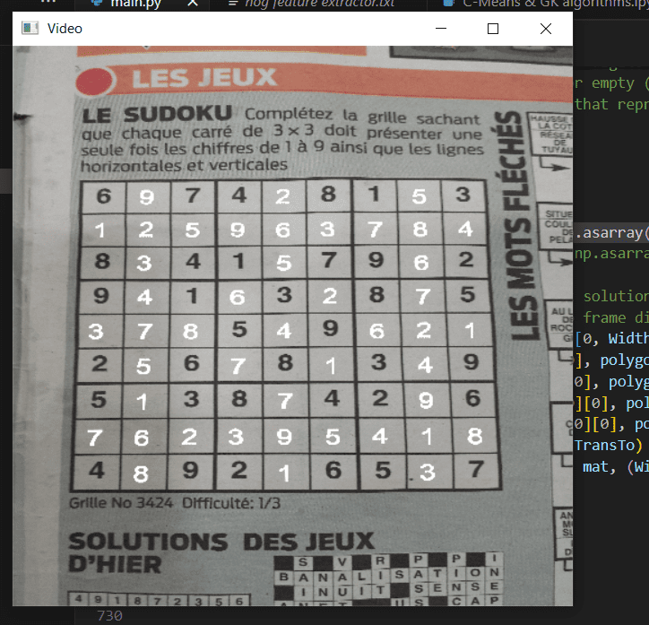
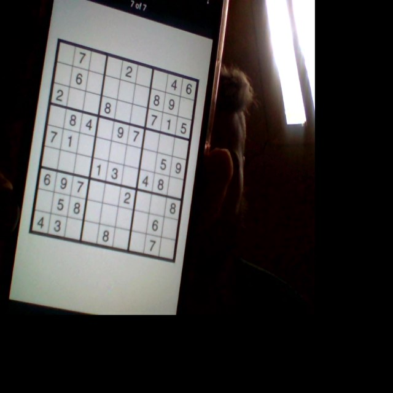
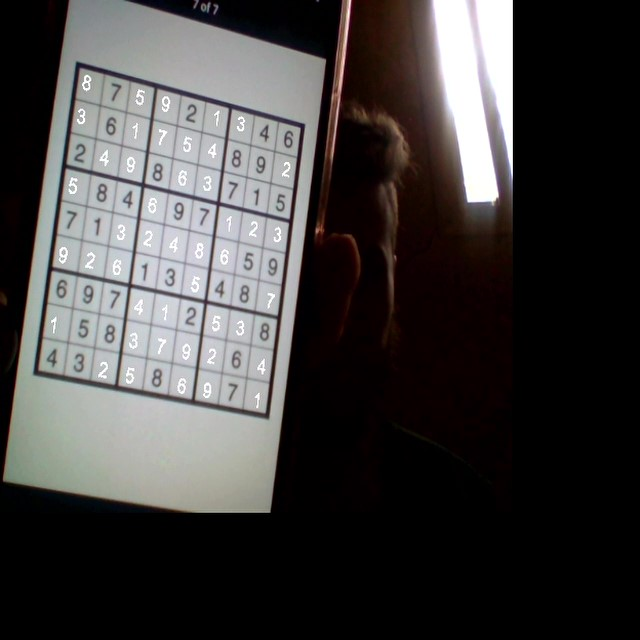

# Real-Time ML Sudoku Solver

## Introduction

Welcome to the Real-Time Sudoku Solver! This project demonstrates a fascinating intersection of computer vision, machine learning, and deep learning to solve Sudoku puzzles directly from video capture. Whether you're a beginner or an experienced developer, this project offers a clear and engaging way to see how these technologies can work together to achieve impressive results.

## Features

- **Real-Time Video Processing**: Captures and processes video input to detect and solve Sudoku puzzles in real-time.
- **Image Input Support**: Besides video, it can also solve Sudoku puzzles from still images.
- **Machine Learning**: Utilizes TensorFlow and Keras for digit recognition.
- **Computer Vision**: Employs OpenCV for image preprocessing and contour detection.
- **Dynamic Overlay**: Displays the solved Sudoku puzzle overlayed on the original video feed.

## Technology Stack

- **Programming Language**: Python
- **Machine Learning Frameworks**: TensorFlow, Keras
- **Computer Vision Library**: OpenCV
- **Environment**: Jupyter Notebook

## Implementation Steps

1. **Video Capture and Preprocessing**:
    - Convert frames to grayscale.
    - Apply adaptive Gaussian threshold to binarize the image.

2. **Contour Detection**:
    - Identify all contours in the image.
    - Filter out contours to isolate the Sudoku grid.
    
3. **Perspective Transformation**:
    - Detect the four corners of the Sudoku grid.
    - Warp the perspective to obtain a top-down view of the Sudoku puzzle.
    
4. **Grid Extraction**:
    - Crop the transformed image into 81 smaller images representing each cell.
    
5. **Digit Recognition**:
    - Use a trained OCR model (TensorFlow and Keras) to recognize digits in each cell.
    - Construct a 2D array representing the Sudoku grid.
    
6. **Sudoku Solving**:
    - Implement a backtracking algorithm to solve the Sudoku puzzle.
    
7. **Overlay Solution**:
    - Create an image of the solved Sudoku with a transparent background.
    - Merge the solution image onto the original frame.
    - Update every 50 frames to ensure real-time performance.

## Results

Here are some screenshots showcasing the solver in action:

### Original Frame

### Solved Sudoku Overlay

## Contributing

Contributions are welcome! If you have any suggestions or improvements, feel free to open an issue or submit a pull request.
